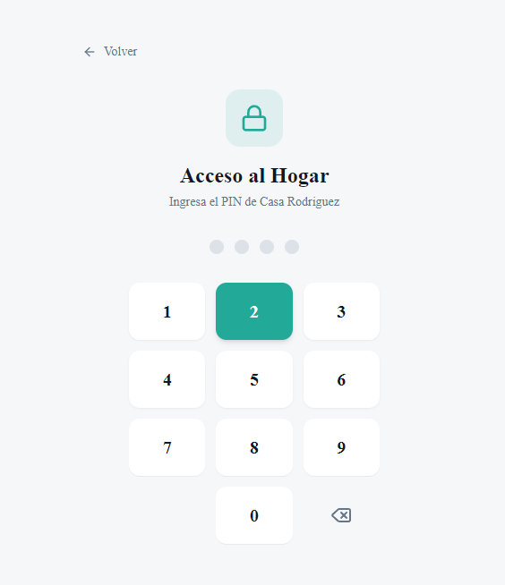
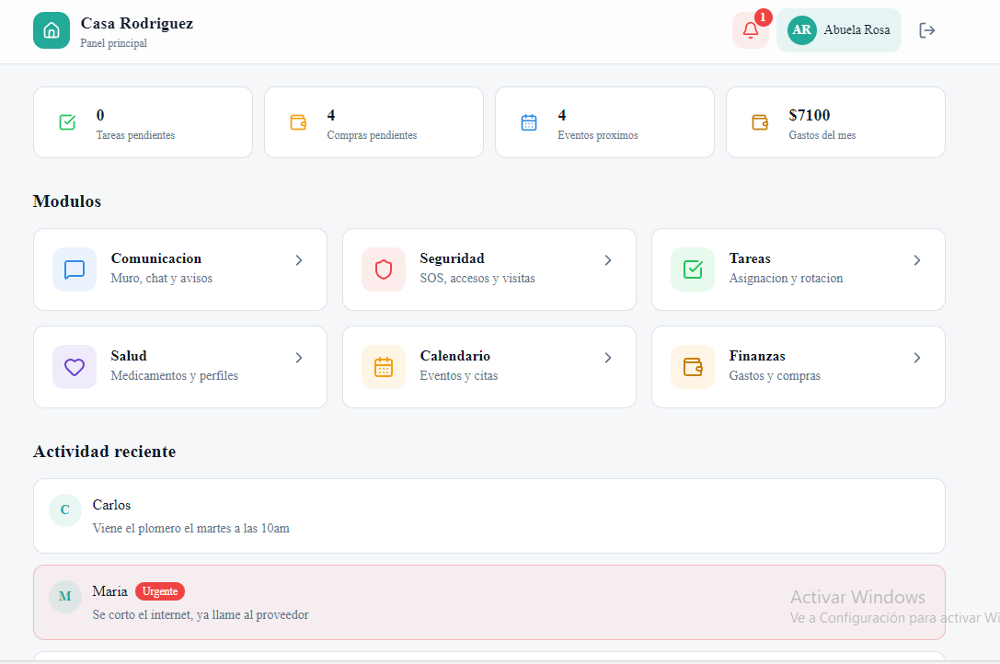
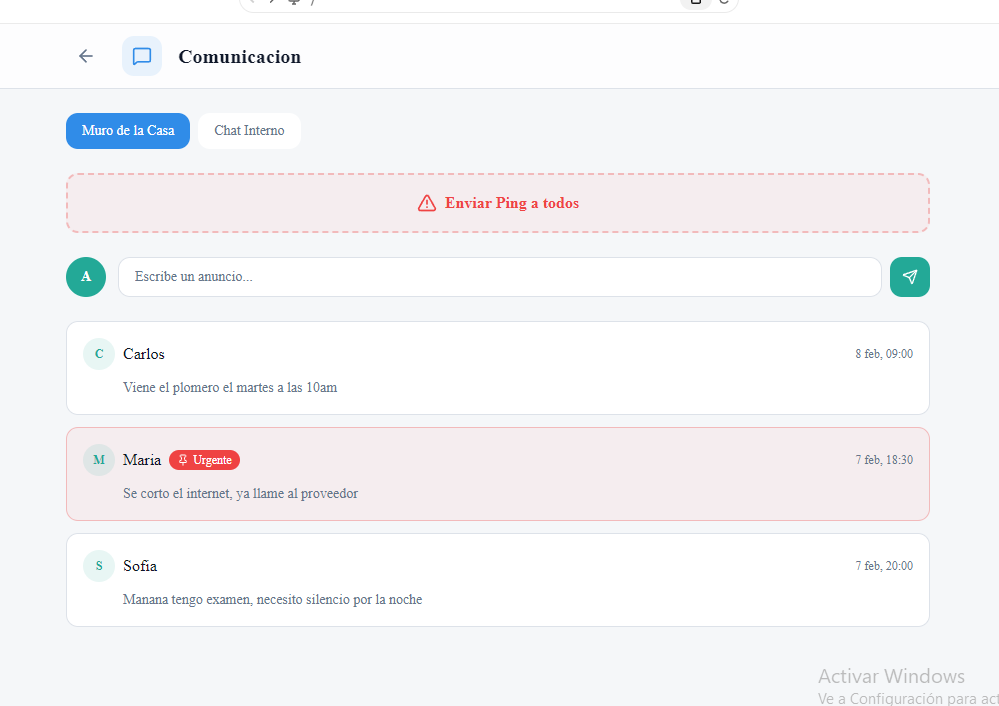
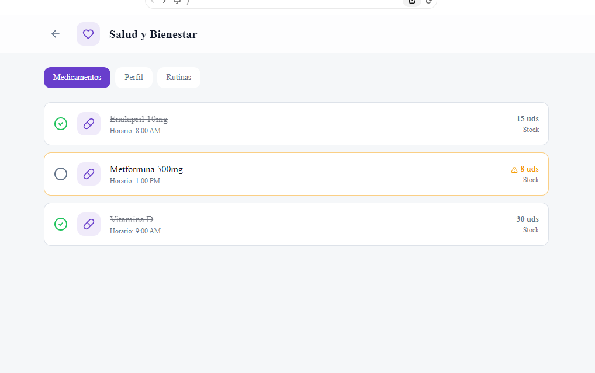
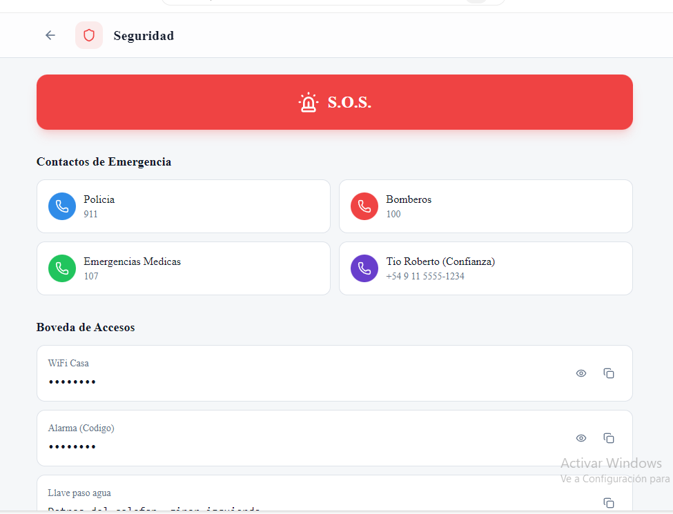

# 🏠 HomeAsisstan

**Sistema Operativo Integral para la Gestión del Hogar**

Plataforma centralizada que digitaliza y simplifica la convivencia. Gestiona tareas, finanzas, comunicación, salud y seguridad de un hogar desde un único punto de acceso, con interfaces adaptables según el perfil de cada usuario.

> 🔒 Funciona **100% local** (LAN del hogar). Sin necesidad de internet ni acceso externo.

---

## 📸 Capturas

<details>
<summary>Ver capturas de pantalla</summary>

| Pantalla | Vista |
|----------|-------|
| Acceso |  |
| Selección de Usuario |  |
| Dashboard |  |
| Dashboard (alt) |  |
| Comunicación |  |
| Tareas |  |
| Calendario |  |
| Finanzas |  |
| Salud |  |
| Seguridad |  |

</details>

---

## ⚡ Stack Tecnológico

| Capa | Tecnología |
|------|-----------|
| **Frontend** | React 19 + Vite 6 + TypeScript |
| **Estilos** | TailwindCSS 4 |
| **Estado** | Zustand + TanStack React Query |
| **Backend** | Node.js 20+ + Express 5 + TypeScript |
| **ORM** | Drizzle ORM |
| **Base de Datos** | PostgreSQL 16 |
| **Tiempo Real** | Socket.IO |
| **Cache** | Redis 7 |
| **Auth** | JWT + bcrypt |
| **Infra** | Docker Compose |

---

## 📁 Estructura del Proyecto

```
homeassistan/
├── packages/
│   ├── shared/        # Tipos TypeScript compartidos
│   ├── database/      # Drizzle ORM schemas, migraciones y seed
│   ├── server/        # API REST + WebSocket (Express)
│   └── web/           # SPA (Vite + React)
├── doc/               # Documentación y capturas
├── docker-compose.yml # PostgreSQL + Redis
├── pnpm-workspace.yaml
└── package.json       # Scripts del monorepo
```

---

## 🚀 Inicio Rápido

### Prerrequisitos

- [Node.js](https://nodejs.org/) >= 20
- [pnpm](https://pnpm.io/) >= 9
- [Docker](https://www.docker.com/) (para PostgreSQL y Redis)

### 1. Clonar e instalar

```bash
git clone <repo-url> homeassistan
cd homeassistan
pnpm install
```

### 2. Variables de entorno

```bash
cp .env.example .env
# Editar .env si es necesario (los valores por defecto funcionan para desarrollo)
```

### 3. Levantar base de datos

```bash
docker compose up -d
```

Esto inicia:
- **PostgreSQL** en `localhost:5432`
- **Redis** en `localhost:6379`

### 4. Crear tablas y datos de prueba

```bash
pnpm db:push        # Sincroniza schema con la BD
pnpm db:seed        # Carga datos de ejemplo
```

### 5. Iniciar desarrollo

```bash
pnpm dev            # Arranca frontend y backend simultáneamente
```

| Servicio | URL |
|----------|-----|
| Frontend | http://localhost:5173 |
| API | http://localhost:3001/api |
| Health Check | http://localhost:3001/api/health |

---

## 🛠️ Scripts Disponibles

| Comando | Descripción |
|---------|-------------|
| `pnpm dev` | Inicia frontend + backend en paralelo |
| `pnpm dev:web` | Solo frontend (Vite) |
| `pnpm dev:server` | Solo backend (Express) |
| `pnpm build` | Build de producción (todos los paquetes) |
| `pnpm db:push` | Sincroniza schemas Drizzle → PostgreSQL |
| `pnpm db:generate` | Genera archivos de migración |
| `pnpm db:migrate` | Ejecuta migraciones pendientes |
| `pnpm db:studio` | Abre Drizzle Studio (GUI de la BD) |
| `pnpm db:seed` | Carga datos de prueba |

---

## 🔐 Autenticación

El sistema usa **doble autenticación contextual**:

1. **Nivel Casa** → Seleccionar casa + PIN compartido
2. **Nivel Usuario** → Seleccionar perfil + PIN personal

```
[Seleccionar Casa] → PIN Casa → [Seleccionar Usuario] → PIN Personal → [Dashboard]
```

### Datos de prueba (seed)

| Entidad | Nombre | PIN |
|---------|--------|-----|
| 🏠 Casa | Casa Demo | `1234` |
| 👤 Admin | Admin | `0000` |
| 👤 Miembro | María | `1111` |
| 👤 Simplificado | Abuelo | `2222` |

---

## 👥 Roles del Sistema

| Rol | Descripción | Ejemplo |
|-----|-------------|---------|
| **Admin** | Control total | Padre/Madre |
| **Responsable** | Gestiona finanzas, tareas, calendario | Pareja |
| **Miembro** | Acceso estándar | Hijo adolescente |
| **Simplificado** | Interfaz grandes botones | Adulto mayor, niño |
| **Externo** | Acceso temporal y limitado | Cuidador, limpieza |
| **Mascota** | Perfil pasivo (sin login) | Perro, gato |

---

## 🧩 Módulos

| Módulo | Estado | Descripción |
|--------|--------|-------------|
| 🔑 Autenticación | ✅ Implementado | Doble nivel (casa + usuario) |
| 📊 Dashboard | ✅ Implementado | Vista pública y privada |
| 💬 Comunicación | 🔲 Pendiente | Muro, chat, botón de pánico |
| ✅ Tareas | 🔲 Pendiente | Asignación, rotación, gamificación |
| 📅 Calendario | 🔲 Pendiente | Eventos compartidos |
| 💰 Finanzas | 🔲 Pendiente | Gastos, lista de compras |
| ❤️ Salud | 🔲 Pendiente | Medicamentos, rutinas |
| 🛡️ Seguridad | 🔲 Pendiente | S.O.S., bóveda, códigos |

---

## 🌐 API Endpoints

### Auth
```
POST   /api/auth/house/select   # Seleccionar casa (PIN)
POST   /api/auth/user/login     # Login de usuario (PIN personal)
POST   /api/auth/refresh        # Refrescar token
POST   /api/auth/logout         # Cerrar sesión
```

### Houses
```
GET    /api/houses               # Listar casas
GET    /api/houses/:id           # Detalle de casa
POST   /api/houses               # Crear casa
PATCH  /api/houses/:id           # Actualizar casa (admin)
DELETE /api/houses/:id           # Eliminar casa (admin)
GET    /api/houses/:id/members   # Miembros de una casa
```

### Users
```
POST   /api/users                # Crear usuario
GET    /api/users/me             # Perfil propio
GET    /api/users/:id            # Obtener usuario
PATCH  /api/users/:id            # Actualizar perfil
DELETE /api/users/:id            # Eliminar usuario (admin)
```

---

## 🐳 Docker

### Desarrollo
```bash
docker compose up -d          # Levantar PostgreSQL + Redis
docker compose down           # Detener servicios
docker compose down -v        # Detener y borrar datos
```

### Ver logs
```bash
docker compose logs -f postgres
docker compose logs -f redis
```

---

## 📄 Documentación

- [Definición del Proyecto](doc/HomeAsisstan.md)
- [Plan de Implementación](doc/plan-implementacion.md)

---

## 📝 Licencia

Proyecto privado. Todos los derechos reservados.
